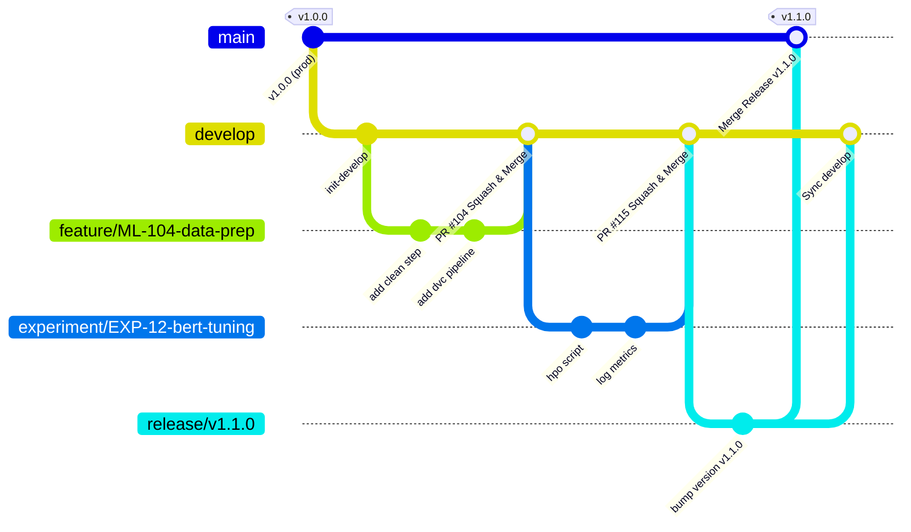

# ML Project Branching Strategy & Workflow Guide

## 1. Overview & Purpose

In production Machine Learning (ML) systems, code is deeply intertwined with data pipelines, model weights, experiment tracking, and infrastructure. A standard software engineering branching model is insufficient on its own; ML projects require strict reproducibility, experiment isolation, traceability of model artifacts, and automated verification of both code quality and pipeline integrity.

This document defines the official Git branching strategy, branch naming conventions, feature branch lifecycle, and merge requirements for reproducible and scalable ML pipelines.

---

## 2. Core Branch Hierarchy & Roles

Our strategy adopts an adapted GitFlow model optimized for Machine Learning pipelines with three primary tiers of branches:

```
                      [main] (Production releases & tagged models)
                        ▲
                        │ (Release PR / Hotfix PR)
                    [release/*]
                        ▲
                        │
                     [develop] (Integration & Staging)
                     ▲      ▲
         (Feature PR)│      │(Experiment PR)
                     │      │
            [feature/*]    [experiment/*]
```

### 2.1 `main` (Production & Releases)
* **Purpose**: Represents the single source of truth for production-ready code, deployment pipelines, model inference services, and validated training workflows.
* **Stability Level**: **Strictly Stable**. Code in `main` is always ready for automated production deployment.
* **Direct Commits**: **Forbidden**. No direct pushes or force pushes under any circumstances.
* **Tagging & Releases**: Every merge into `main` is tagged with a semantic version (e.g., `v1.2.0`), corresponding to an audited model version in the Model Registry.
* **Retention**: Permanent.

### 2.2 `develop` (Integration & Pre-Production)
* **Purpose**: Serves as the central integration branch for completed features, tested pipeline components, and validated model architectures. Acts as the staging environment.
* **Stability Level**: **Stably Integrated**. All code has passed automated unit tests, integration tests, and pipeline smoke tests.
* **Direct Commits**: **Forbidden**. Changes must be integrated via Pull Requests (PRs).
* **Retention**: Permanent.

### 2.3 Supporting Branches

| Branch Pattern | Base Branch | Merge Target | Purpose | Lifespan |
| :--- | :--- | :--- | :--- | :--- |
| `feature/*` | `develop` | `develop` | Development of pipeline steps, preprocessing, APIs, infra | Temporary (deleted after merge) |
| `experiment/*` | `develop` | `develop` | ML model exploration, architecture trials, hyperparameter tuning | Temporary |
| `bugfix/*` | `develop` | `develop` | Resolving bugs identified in staging or development | Temporary |
| `release/*` | `develop` | `main` & `develop` | Release stabilization, version bumping, changelog updates | Temporary |
| `hotfix/*` | `main` | `main` & `develop` | Critical emergency fixes directly impacting production | Temporary |

---

## 3. Branch Naming Conventions

All branch names must strictly follow structured prefixes and kebab-case naming to ensure traceability to tracking boards (Jira, GitHub Issues) and automated CI pipeline routing.

### 3.1 Syntax Pattern
```
<type>/<ticket-id>-<short-description>
```

* **`<type>`**: One of `feature`, `experiment`, `bugfix`, `hotfix`, `release`, `data`
* **`<ticket-id>`**: Issue tracker identifier (e.g., `ML-104`, `DS-42`, `GH-89`), or `exp-<id>` for experimental studies.
* **`<short-description>`**: 2–4 lowercase words separated by hyphens (`-`) summarizing the change.

### 3.2 Branch Categories & Concrete Examples

| Branch Type | Syntax | Valid Examples | Description / Scope |
| :--- | :--- | :--- | :--- |
| **Feature** | `feature/<ticket>-<description>` | `feature/ML-104-dvc-pipeline-caching`<br>`feature/ML-120-add-xgboost-trainer`<br>`feature/ML-135-batch-inference-api` | New capabilities, pipeline components, data transformations, evaluation metrics. |
| **Experiment** | `experiment/<id>-<description>` | `experiment/EXP-12-vit-vs-resnet`<br>`experiment/EXP-34-focal-loss-tuning`<br>`experiment/ML-99-optuna-hpo` | Research, novel architectures, hyperparameter searches, feature selection studies. |
| **Bugfix** | `bugfix/<ticket>-<description>` | `bugfix/ML-112-fix-nan-gradient-clipping`<br>`bugfix/ML-140-null-feature-imputation` | Non-critical fixes for staging/develop pipelines and data ingestion. |
| **Hotfix** | `hotfix/<ticket>-<version-patch>` | `hotfix/PROD-01-fix-inference-timeout`<br>`hotfix/v1.2.1-cuda-oom-batch-size` | High-priority production issues branching directly off `main`. |
| **Release** | `release/<version>` | `release/v1.2.0`<br>`release/v2.0.0-rc1` | Release candidate stabilization branch. |

### 3.3 Invalid Branch Names
* ❌ `new-feature` *(missing prefix, no ticket reference)*
* ❌ `feature/add_data_loader` *(use hyphens, not underscores)*
* ❌ `Feature/ML-10-DataClean` *(use lowercase only)*
* ❌ `experiment-test` *(missing slash separator and ID)*
* ❌ `john/my-work` *(do not name branches after individuals)*

---

## 4. Example Feature Branch Structure & Lifecycle

### 4.1 Git Flow Workflow Diagram



### 4.2 Step-by-Step Lifecycle of a Feature Branch

1. **Pull Latest Integration Code**:
   ```bash
   git checkout develop
   git pull origin develop
   ```

2. **Create Branch with Proper Convention**:
   ```bash
   git checkout -b feature/ML-104-dvc-pipeline-caching
   ```

3. **Atomic Commits & Versioning**:
   * Commit code and configuration files.
   * Version data and model artifacts using DVC / tracking pointers (never commit raw data or heavy checkpoints directly to Git).
   ```bash
   git add src/pipeline/stage_cache.py configs/pipeline.yaml dvc.yaml dvc.lock
   git commit -m "feat(pipeline): implement caching mechanism for stage outputs [ML-104]"
   ```

4. **Rebase Onto Develop Before Submitting**:
   Keep branch history linear and resolve any merge conflicts locally before PR submission:
   ```bash
   git fetch origin
   git rebase origin/develop
   ```

5. **Push and Open Pull Request**:
   ```bash
   git push -u origin feature/ML-104-dvc-pipeline-caching
   ```

6. **Automatic Deletion**:
   Once merged into `develop`, the remote and local feature branches are deleted.

---

## 5. Merge Requirements & Quality Gates

To preserve the reproducibility of the ML pipeline and maintain high code and model standards, all PRs must fulfill rigorous quality gates before merging.

### 5.1 Mandatory Automated CI/CD Checks

Before any PR can be merged into `develop` or `main`, the CI pipeline must pass 100%:

1. **Code Formatting & Linting**:
   * Code formatting: `black --check .`, `isort --check-all .`
   * Linting: `flake8` or `ruff` with zero errors.
   * Type Checking: `mypy src/` passes.

2. **Automated Testing**:
   * Unit tests: `pytest tests/unit/` (minimum 80% coverage required).
   * Integration tests: Pipeline stage integration tests `pytest tests/integration/`.

3. **ML Pipeline Smoke Test**:
   * Execution of a lightweight pipeline run (`dvc repro` or script dry-run) using a deterministic sample dataset (e.g., 100 rows / 1 epoch) to verify that end-to-end data transformation, model forward pass, and metric calculation run without errors.

4. **Configuration Validation**:
   * Validation of schema configuration files (Hydra / Pydantic models) to ensure hyperparameter syntax consistency.

### 5.2 Code Review Policy

* **Minimum Approvals**:
  * Merges into `develop`: Minimum **1 approval** from an ML Engineer or Data Scientist peer.
  * Merges into `main`: Minimum **2 approvals**, including the Lead ML Engineer / Repository Maintainer.
* **Review Checklist**:
  * [ ] Are random seeds explicitly set and logged for reproducibility?
  * [ ] Are data pointers (DVC hash, S3 URIs) tracked instead of raw files?
  * [ ] Are metrics and hyperparameters tracked in MLflow/W&B?
  * [ ] Are pipeline configs updated in `configs/`?
  * [ ] Have integration and unit tests been added or updated?

### 5.3 Merge Strategies

| Target Branch | Source Branch | Merge Method | Rationale |
| :--- | :--- | :--- | :--- |
| `develop` | `feature/*` or `experiment/*` | **Squash and Merge** | Creates a single atomic commit with the ticket number, maintaining a clean, linear history on `develop`. |
| `develop` | `bugfix/*` | **Squash and Merge** | Consolidates bug investigation commits into a clear fix commit. |
| `main` | `release/*` | **Merge Commit (`--no-ff`)** | Preserves release history, release commit boundaries, and tags. |
| `main` | `hotfix/*` | **Merge Commit (`--no-ff`)** | Clearly documents emergency production patches. |

### 5.4 Branch Protection Rules

The following protections are configured in the Git repository settings:

* **For `main`**:
  * Require a pull request before merging.
  * Require at least 2 approving reviews.
  * Require status checks to pass before merging (Linting, Tests, Pipeline dry-run).
  * Require branches to be up to date before merging.
  * Do not allow force pushes (`push --force` disabled).
  * Do not allow deletions of `main`.

* **For `develop`**:
  * Require a pull request before merging.
  * Require at least 1 approving review.
  * Require all CI status checks to pass.
  * Do not allow force pushes.

---

## 6. Reproducibility & ML-Specific Guidelines

### 6.1 Decoupling Code, Data, and Model Weights
1. **Never Commit Raw Data or Model Checkpoints**:
   * Large binaries (`.csv`, `.parquet`, `.pt`, `.onnx`, `.pkl`) are excluded via `.gitignore`.
2. **Version Data with Trackers**:
   * Track datasets with DVC (`.dvc` files) or store deterministic dataset versions in S3/GCS referenced in Git-tracked configs.
3. **Log Experiment Runs**:
   * For every training commit on `experiment/*` or `develop`, log the Git commit hash (`git rev-parse HEAD`), hyperparameter config, and output metrics to the centralized experiment tracker (MLflow / Weights & Biases).

### 6.2 Experiment to Production Flow
1. An experiment begins on `experiment/EXP-XX-...`.
2. Once validation metrics exceed the benchmark on the held-out validation set, the code is refactored into modular components.
3. A PR is opened to merge into `develop` using the standardized PR template.
4. When a release cycle is triggered, a `release/vX.Y.Z` branch validates the model on the full test suite.
5. Merging to `main` tags the release, registers the trained model artifact to the Production Model Registry, and triggers the deployment pipeline.

---

## 7. Summary Quick-Reference Table

| Operation | Command / Pattern |
| :--- | :--- |
| Start new feature | `git checkout develop && git pull && git checkout -b feature/ML-<ticket>-<name>` |
| Start ML experiment | `git checkout develop && git pull && git checkout -b experiment/EXP-<id>-<name>` |
| Commit with Conventional Commit | `git commit -m "feat(model): add focal loss implementation [ML-104]"` |
| Sync with develop before PR | `git fetch origin && git rebase origin/develop` |
| Merge method to `develop` | **Squash and Merge** via Pull Request |
| Merge method to `main` | **Merge Commit** via Release PR |
