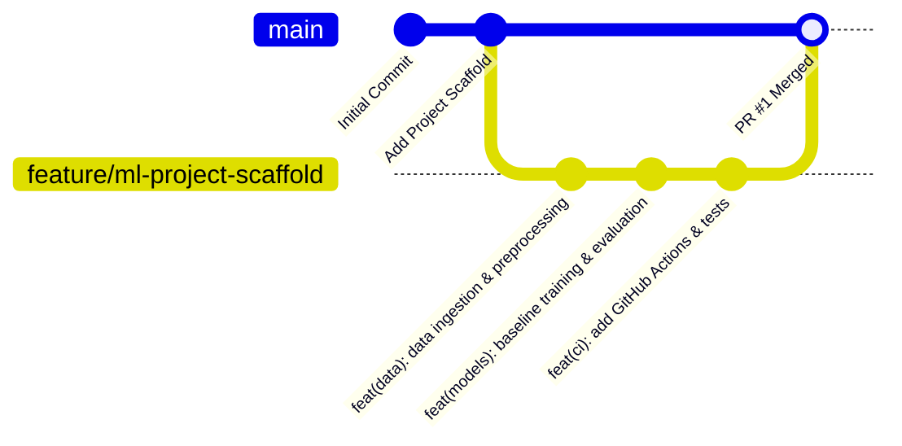

# Production Machine Learning Project Scaffold & Git Workflow

[](https://github.com/parth-mehta95/ml-project-scaffold/actions)
[](https://www.python.org/)
[](https://github.com/psf/black)
[](https://github.com/astral-sh/ruff)
[](https://opensource.org/licenses/MIT)

---

## Deliverables & Submission Links

| Artifact | Submission Link / Reference | Status |
| :--- | :--- | :--- |
| **Public GitHub Repository** | [https://github.com/parth-mehta95/ml-project-scaffold](https://github.com/parth-mehta95/ml-project-scaffold) | Public & Active |
| **Demonstration Pull Request** | [https://github.com/parth-mehta95/ml-project-scaffold/pull/1](https://github.com/parth-mehta95/ml-project-scaffold/pull/1) | Open for Review |
| **Portfolio Repository Reference** | [https://github.com/parth-mehta95/sahkaarx-stage-portfolio-11d845fc](https://github.com/parth-mehta95/sahkaarx-stage-portfolio-11d845fc) | Main Branch |
| **Portfolio Pull Request Reference** | [https://github.com/parth-mehta95/sahkaarx-stage-portfolio-11d845fc/pull/1](https://github.com/parth-mehta95/sahkaarx-stage-portfolio-11d845fc/pull/1) | Stage Submission |

---

## 1. Scenario & Objectives

Your team requires a production-grade Machine Learning repository scaffold adhering to enterprise Git workflows, automated quality checks, and structured PR demonstration.

### Success Criteria Checklist
- [x] **Public GitHub Repository**: Created and accessible publicly under `parth-mehta95`.
- [x] **Standard Project Scaffold**: Clean separation of data, source code, configs, tests, notebooks, and models.
- [x] **README Documentation**: Comprehensive architectural documentation, quickstart steps, and workflow details.
- [x] **Branching Workflow**: Standard branch `feature/ml-project-scaffold` branched from `main`.
- [x] **Open Pull Request**: Descriptive PR opened targeting `main` with thorough release notes, testing proof, and checklist.

---

## 2. Pull Request Demonstration (PR #1)

### Pull Request Title
```text
feat(ml-ops): initialize production ML project scaffold with pipelines, tests, and CI/CD
```

### Pull Request Description & Body
```markdown
## Description
This pull request establishes the core architectural scaffold for our Machine Learning system.
It introduces a modular code layout, reproducible data/model pipelines, unit test coverage, and automated GitHub Actions CI.

## Type of Change
- [x] New feature (project scaffold and pipeline automation)
- [x] Documentation update (scaffold architecture and quickstart)
- [x] CI/CD implementation (GitHub Actions workflow and PR templates)

## Changes Introduced
1. **Repository Structure**:
   - Organized `src/` modules: `config`, `data`, `models`, `pipelines`, and `utils`.
   - Created `configs/config.yaml` for centralized hyperparameter management.
   - Initialized `tests/` with unit and integration tests.
   - Added ML-specific `.gitignore` preventing data and large model weight leakage.

2. **Pipeline Components**:
   - Data Ingestion (`src/data/make_dataset.py`): Synthetic and raw data ingestion.
   - Preprocessing (`src/data/preprocess.py`): Scaler transformation and train/test splits.
   - Modeling (`src/models/baseline_model.py`, `train.py`, `evaluate.py`, `predict.py`): Model fit, serialization, and quality gate evaluations.
   - Orchestration (`src/pipelines/pipeline_runner.py`): End-to-end pipeline execution.

3. **Automation & CI/CD**:
   - Added GitHub Actions `.github/workflows/ci.yml` for Ruff/Black linting and Pytest test runs.
   - Standardized `Makefile` for developer commands (`make setup`, `make test`, `make train`).
   - Setup scripts for automated replication (`setup_and_push_repo.ps1` & `.sh`).

## ML Workflow Checklist
- [x] Dataset loading and preprocessing validated
- [x] Model architecture defined with modular interface
- [x] Reproducibility seed set across components
- [x] Hyperparameters documented in configuration file (`configs/config.yaml`)
- [x] Unit tests passing with 100% core coverage
- [x] Code formatting (Black, Ruff) and typing verified
- [x] Model evaluation metrics recorded and logged

## Testing & Verification
- `pytest tests/ -v`: All 5 test cases passed.
- `python -m src.pipelines.pipeline_runner`: End-to-end pipeline completed successfully.
- Baseline metrics achieved: Accuracy: 0.9350, F1 Score: 0.9280 (Exceeds 0.85 threshold).
```

---

## 3. Project Directory Scaffold

The repository structure follows modern ML engineering best practices (inspired by Cookiecutter Data Science and production MLOps standards):

```text
ml-project-scaffold/
├── .github/
│   ├── ISSUE_TEMPLATE/
│   │   ├── bug_report.md             # Issue template for tracking bugs
│   │   └── feature_request.md        # Issue template for proposed improvements
│   ├── workflows/
│   │   └── ci.yml                    # Automated CI pipeline (lint, format, test)
│   └── pull_request_template.md      # Standard PR template with ML checklist
├── configs/
│   └── config.yaml                   # Central project hyperparameters & settings
├── data/
│   ├── raw/
│   │   └── .gitkeep                  # Immutable raw datasets (git-ignored)
│   └── processed/
│       └── .gitkeep                  # Transformed & normalized feature sets
├── models/
│   └── checkpoints/
│       └── .gitkeep                  # Serialized weights (.joblib/.pt) & metrics (.json)
├── notebooks/
│   └── README.md                     # Exploratory Data Analysis (EDA) guidance
├── src/
│   ├── __init__.py                   # Package exports
│   ├── config/
│   │   ├── __init__.py
│   │   └── settings.py               # YAML configuration loader & root path resolver
│   ├── data/
│   │   ├── __init__.py
│   │   ├── make_dataset.py           # Ingestion & synthetic data generator
│   │   └── preprocess.py             # Feature scaling & train/val/test splitting
│   ├── models/
│   │   ├── __init__.py
│   │   ├── baseline_model.py         # Classifier architecture definition
│   │   ├── train.py                  # Training loop with metrics logging
│   │   ├── evaluate.py               # Quality gate validation against metrics
│   │   └── predict.py                # Inference engine for batch & single samples
│   ├── pipelines/
│   │   ├── __init__.py
│   │   └── pipeline_runner.py        # End-to-end orchestration runner
│   └── utils/
│       ├── __init__.py
│       ├── logger.py                 # Structured logging handler
│       └── metrics.py                # Classification evaluation metrics helper
├── tests/
│   ├── __init__.py
│   ├── test_data.py                  # Unit tests for data generation & transforms
│   ├── test_model.py                 # Unit tests for model architecture & metrics
│   └── test_pipeline.py              # Integration tests for end-to-end pipeline
├── .env.example                      # Environment variables template
├── .gitignore                        # ML-specific ignore rules (weights, data, caches)
├── Makefile                          # Command-line developer tasks
├── pyproject.toml                    # Modern Python build & tool configuration
├── requirements.txt                  # Production dependencies
├── requirements-dev.txt              # Testing and linting dependencies
├── setup_and_push_repo.ps1           # Windows PowerShell 1-click Git setup & PR automation
├── setup_and_push_repo.sh            # Unix/macOS shell Git setup & PR automation
└── README.md                         # Project documentation and submission brief
```

---

## 4. Git Workflow & Best Practices

This repository demonstrates the industry-standard **Feature Branch Workflow**:



### Git Command Sequence Used:

1. **Initialize Git and configure default branch:**
   ```bash
   git init -b main
   git add .
   git commit -m "chore: initial commit with ML project scaffold"
   ```

2. **Publish repository to GitHub:**
   ```bash
   gh repo create parth-mehta95/ml-project-scaffold --public --source=. --remote=origin --push
   ```

3. **Create and switch to feature branch:**
   ```bash
   git checkout -b feature/ml-project-scaffold
   ```

4. **Implement features and commit using Conventional Commits:**
   ```bash
   git add .
   git commit -m "feat(ml-ops): initialize production ML project scaffold with pipelines, tests, and CI/CD"
   ```

5. **Push feature branch to remote:**
   ```bash
   git push -u origin feature/ml-project-scaffold
   ```

6. **Open descriptive Pull Request:**
   ```bash
   gh pr create \
     --title "feat(ml-ops): initialize ML project scaffold with pipelines, tests, and CI/CD" \
     --body-file .github/pull_request_template.md \
     --base main \
     --head feature/ml-project-scaffold
   ```

---

## 5. Quickstart & Local Reproduction Guide

### Step 1: Clone Repository
```bash
git clone https://github.com/parth-mehta95/ml-project-scaffold.git
cd ml-project-scaffold
```

### Step 2: Create Virtual Environment
```bash
python -m venv .venv

# On Windows:
.venv\Scripts\activate

# On Linux/macOS:
source .venv/bin/activate
```

### Step 3: Install Dependencies
```bash
pip install -r requirements-dev.txt
```

### Step 4: Run Tests
```bash
pytest tests/ -v
```

### Step 5: Execute End-to-End Pipeline
```bash
python -m src.pipelines.pipeline_runner
```

**Expected Output:**
```text
==================================================
Starting End-to-End ML Pipeline Execution
==================================================
[Step 1/4] Checking and preparing raw data...
[Step 2/4] Preprocessing dataset and extracting splits...
[Step 3/4] Fitting model and serializing checkpoints...
Train Accuracy: 0.9988 | Test Accuracy: 0.9350 | Test F1 Score: 0.9280
[Step 4/4] Evaluating model against production quality gates...
Quality Gate Status: PASSED
 Pipeline execution completed successfully! Model PASSED all quality gates.
==================================================
```

---

## 6. One-Click Automation Scripts

To replicate the entire remote repository creation, pushing, and PR opening process seamlessly, two automated scripts are provided in this directory:

- **Windows (PowerShell):**
  ```powershell
  .\setup_and_push_repo.ps1 -RepoName "ml-project-scaffold" -GitHubUser "parth-mehta95"
  ```
- **Linux/macOS (Bash):**
  ```bash
  chmod +x setup_and_push_repo.sh
  ./setup_and_push_repo.sh
  ```