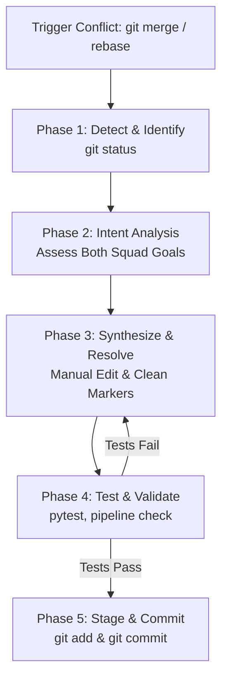

# Enterprise Guide to Git Merge Conflict Resolution in MLOps

[](https://git-scm.com/)
[](https://mlops.community/)
[]()

---

## 1. Introduction & Overview

In high-velocity Machine Learning teams, multiple engineers frequently develop features concurrently:
- **Modeling squads** experiment with hyperparameters, regularization, and model architectures.
- **Inference/MLOps squads** optimize latency, resource utilization, and container memory footprints.
- **Data squads** alter preprocessing logic and feature encodings.

When two engineers modify overlapping regions of the same file (such as `configs/config.yaml` or `src/models/baseline_model.py`) and merge their branches, Git is unable to determine programmatically which change should take precedence. This results in a **Git Merge Conflict**.

This guide details the theoretical foundation, step-by-step Standard Operating Procedure (SOP), and ML-specific strategies for resolving merge conflicts safely and effectively.

---

## 2. Anatomy of a Merge Conflict

### The 3-Way Merge Algorithm

Git uses a **3-way merge algorithm** (`recursive` or `ort` strategy) to reconcile two divergent branches:

```text
                  ┌── [Commit A] feature/model-v2-regularization (HEAD)
                  │
[Base Commit] ────┤ (Merge Base)
                  │
                  └── [Commit B] feature/model-v2-efficiency (MERGE_HEAD)
```

1. **Merge Base**: The most recent common ancestor commit between the two branches.
2. **OURS (`HEAD`)**: The tip of the current active branch (the branch you are merging *into*, e.g., `main`).
3. **THEIRS (`MERGE_HEAD`)**: The tip of the incoming branch being merged.

If both `OURS` and `THEIRS` introduced changes to the **exact same lines** compared to `Merge Base`, Git stops and leaves **conflict markers** in the file.

---

### Conflict Marker Anatomy

When a conflict occurs, Git embeds special text markers into the affected files:

```yaml
<<<<<<< HEAD (Current Branch / OURS)
  # Changes made on the current branch (e.g., feature/model-v2-regularization)
  n_estimators: 150
  max_depth: 12
  criterion: "entropy"
=======
  # Changes made on the incoming branch (e.g., feature/model-v2-efficiency)
  n_estimators: 60
  max_depth: 6
  criterion: "gini"
>>>>>>> feature/model-v2-efficiency (Incoming Branch / THEIRS)
```

| Marker | Meaning |
| :--- | :--- |
| `<<<<<<< HEAD` | Denotes the start of the conflict. The lines directly below are from your current branch. |
| `=======` | The divider separating your changes from the incoming changes. |
| `>>>>>>> [branch-name]` | Denotes the end of the conflict. The lines directly above are from the incoming branch. |

> [!TIP]
> **Enable Diff3 Style in Git**:
> To view the common ancestor (`BASE`) alongside `OURS` and `THEIRS`, enable `diff3`:
> ```bash
> git config --global merge.conflictstyle diff3
> ```
> This adds a `||||||| merged common ancestors` section between `<<<<<<<` and `=======`.

---

## 3. The 5-Phase Conflict Resolution SOP

Follow this strict 5-phase procedure whenever a conflict arises:



---

### Phase 1: Detection & Identification

When Git halts execution with `Automatic merge failed; fix conflicts and then commit the result`:

1. Check repository status:
   ```bash
   git status
   ```
2. Unmerged files appear under `Unmerged paths`:
   ```text
   Unmerged paths:
     (use "git add <file>..." to mark resolution)
           both modified:   configs/config.yaml
           both modified:   src/models/baseline_model.py
   ```
3. View the precise conflicting diffs:
   ```bash
   git diff
   ```

---

### Phase 2: Intent Analysis

Before deleting any code, understand **why** both engineers made their modifications:
- Check git commit history on both branches:
  ```bash
  git log -n 3 --oneline HEAD
  git log -n 3 --oneline MERGE_HEAD
  ```
- Identify the business objectives:
  - Squad A wanted **tree regularization** (`n_estimators: 150`, `max_depth: 12`) to prevent overfitting.
  - Squad B wanted **low-latency edge execution** (`n_estimators: 60`, `max_depth: 6`) to meet sub-15ms SLAs.
- **Rule of Thumb**: Avoid blindly choosing "Accept Current" or "Accept Incoming". In production ML systems, true resolution almost always requires **architectural synthesis**.

---

### Phase 3: Manual Reconciliation & Clean Editing

Open the conflicted files in your editor (e.g. VS Code, Vim, or IDE).

1. **Remove ALL conflict markers**:
   - Delete `<<<<<<< HEAD`
   - Delete `=======`
   - Delete `>>>>>>> [branch]`
2. **Synthesize the code**:
   - Rather than choosing one squad's hyperparameters over the other, introduce a **multi-profile architecture**:

```yaml
# Reconciled Solution:
model:
  name: "RandomForestClassifier"
  active_profile: "production_regularized"

  profiles:
    production_regularized:
      n_estimators: 150
      max_depth: 12
      criterion: "entropy"
      class_weight: "balanced"
      target_accuracy: 0.90
      target_f1: 0.88

    edge_low_latency:
      n_estimators: 60
      max_depth: 6
      criterion: "gini"
      max_features: "sqrt"
      target_accuracy: 0.82
      target_f1: 0.80
      target_latency_ms: 15.0
```

3. **Verify syntax**:
   - For YAML files: Ensure indentation is 2 spaces without tabs.
   - For Python files: Ensure imports, type hints, and function arguments are preserved.

---

### Phase 4: Test & Validate

Never commit a resolved conflict without verifying that code builds, lints, and passes all test suites!

1. **Check for leftover markers**:
   ```bash
   # Search for accidental marker residue
   grep -rnE "<<<<<<<|=======|>>>>>>>" configs/ src/ tests/
   ```
2. **Run Unit Tests**:
   ```bash
   pytest tests/ -v
   ```
3. **Run Conflict Verification Tests**:
   ```bash
   pytest tests/test_conflict_resolution.py -v
   ```
4. **Smoke-test the ML Pipeline**:
   ```bash
   python -m src.pipelines.pipeline_runner production_regularized
   python -m src.pipelines.pipeline_runner edge_low_latency
   ```

---

### Phase 5: Stage & Commit

1. **Stage resolved files**:
   ```bash
   git add configs/config.yaml
   git add src/models/baseline_model.py
   ```
2. **Verify git status shows all conflicts resolved**:
   ```bash
   git status
   # Output should indicate: "All conflicts fixed but you are still merging"
   ```
3. **Commit with a descriptive message**:
   ```bash
   git commit -m "merge: resolve merge conflicts between feature/model-v2-regularization and feature/model-v2-efficiency

   Reconciled conflicting hyperparameter definitions in configs/config.yaml and
   src/models/baseline_model.py by introducing multi-profile architecture supporting
   both 'production_regularized' (high capacity) and 'edge_low_latency' (sub-15ms inference).
   Preserved requirements from both modeling and edge inference squads."
   ```
4. **Push resolved branch to remote**:
   ```bash
   git push origin main
   ```

---

## 4. Resolving Conflicts in Specific MLOps Scenarios

### Scenario A: Hyperparameter & Configuration YAML Conflicts
- **Problem**: Multiple engineers tune the same keys or introduce differing config schemas.
- **Solution**: Use structured namespaces (`model.profiles`, `training.experiments`) rather than flat keys.

### Scenario B: Jupyter Notebook (`.ipynb`) Conflicts
- **Problem**: Jupyter Notebooks are JSON files containing transient execution counts, cell IDs, and base64 plots. Concurrent edits almost guarantee unreadable JSON conflicts.
- **Best Practices**:
  1. **Strip outputs before committing**:
     ```bash
     pip install nbstripout
     nbstripout --install
     ```
  2. **Use `jupytext`**: Pair `.ipynb` with `.py` light scripts, track only the `.py` script in Git.
  3. **Use `nbdime`**: Specialized visual merge tool for Jupyter Notebooks:
     ```bash
     pip install nbdime
     nbdime config-git --enable --global
     ```

### Scenario C: Model Weights & Dataset Conflicts
- **Rule**: NEVER store raw binary weights (`.pt`, `.joblib`) or large datasets (`.csv`, `.parquet`) directly in Git.
- **Solution**: Use **DVC (Data Version Control)** or **Git LFS**:
  - Git tracks only small `.dvc` pointer files (hashes).
  - Merging pointer files avoids binary merge collisions.

---

## 5. Helpful Git CLI Cheat Sheet

| Command | Description |
| :--- | :--- |
| `git status` | Lists all unmerged and conflicting files. |
| `git diff` | Shows conflict markers across all unmerged files. |
| `git diff --base <file>` | Shows changes relative to the common ancestor. |
| `git diff --ours <file>` | Shows changes relative to your branch (`HEAD`). |
| `git diff --theirs <file>` | Shows changes relative to incoming branch (`MERGE_HEAD`). |
| `git checkout --ours <file>` | Discards incoming changes and keeps your branch's file. |
| `git checkout --theirs <file>` | Discards your changes and takes incoming branch's file. |
| `git merge --abort` | Completely cancels the merge and returns to pre-merge state. |
| `git rebase --abort` | Cancels an ongoing rebase and returns to pre-rebase state. |
| `git config --global rerere.enabled true` | Enables **Reuse Recorded Resolution** to remember how you resolved a conflict. |
