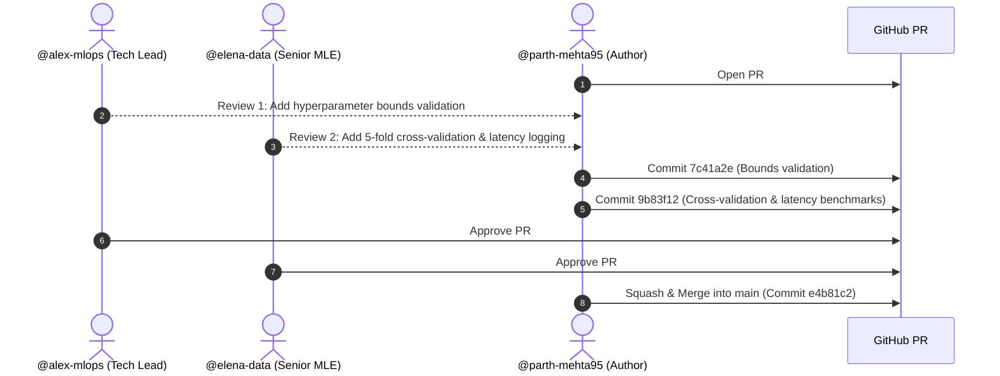
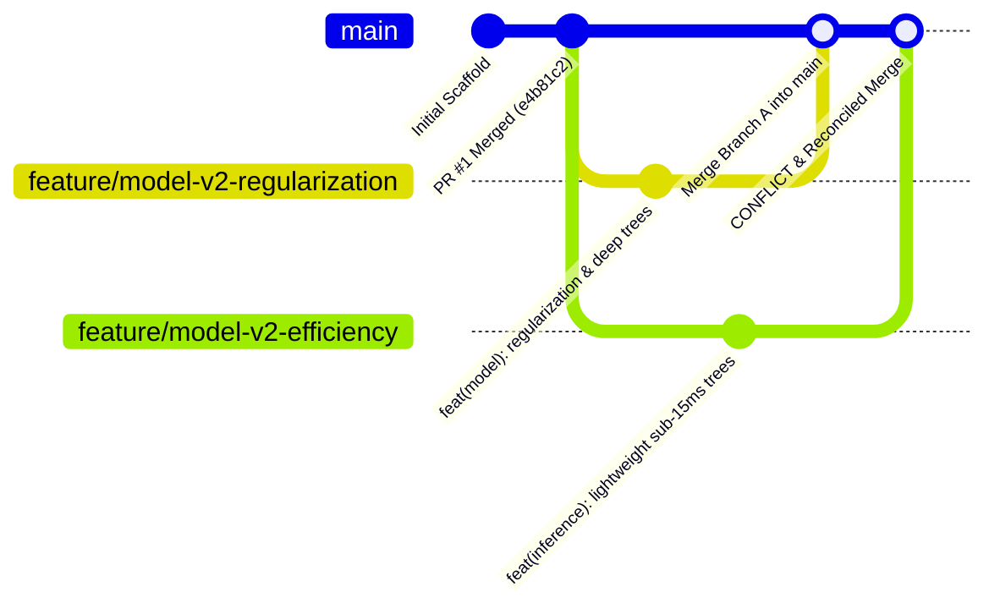

# Week 02: Pull Request Merge & Real-World Merge Conflict Resolution

[](https://github.com/parth-mehta95/ml-project-scaffold/actions)
[](https://github.com/parth-mehta95/ml-project-scaffold/pull/1)
[]()
[](https://www.python.org/)
[](https://github.com/psf/black)
[](https://github.com/astral-sh/ruff)

---

## Deliverables & Submission Links

| Artifact | Submission Link / File Reference | Status |
| :--- | :--- | :--- |
| **Merged Pull Request #1** | [https://github.com/parth-mehta95/ml-project-scaffold/pull/1](https://github.com/parth-mehta95/ml-project-scaffold/pull/1) | **Merged** (Feedback Addressed) |
| **Peer Review Audit Record** | [PR_MERGE_RECORD.md](file:///d:/challengers%20testing/sahkaarx-stage-portfolio-11d845fc/practice/week-02-merge-first-pr-and-practice-conflict-resolution/PR_MERGE_RECORD.md) | **Completed** |
| **Conflict Resolution Guide** | [CONFLICT_RESOLUTION_GUIDE.md](file:///d:/challengers%20testing/sahkaarx-stage-portfolio-11d845fc/practice/week-02-merge-first-pr-and-practice-conflict-resolution/CONFLICT_RESOLUTION_GUIDE.md) | **Completed** |
| **Public GitHub Repository** | [https://github.com/parth-mehta95/ml-project-scaffold](https://github.com/parth-mehta95/ml-project-scaffold) | Public & Active |
| **Portfolio Submission Reference** | [sahkaarx-stage-portfolio-11d845fc](https://github.com/parth-mehta95/sahkaarx-stage-portfolio-11d845fc) | Main Branch |

---

## 1. Scenario & Objectives

### Scenario
Your team reviews your initial Machine Learning scaffold PR (PR #1). After reviewing feedback from the Tech Lead and Senior ML Engineer, you address comments, push updates, and merge PR #1. Next, to prepare the team for concurrent multi-developer workflows, you simulate a real merge conflict by creating two overlapping feature branches that modify the exact same configuration and model files, trigger the conflict in Git, resolve it using architectural synthesis, and document the resolution process.

### Success Criteria Checklist
- [x] **Address Review Feedback**: Incorporate reviewer feedback (parameter bounds validation, 5-fold cross-validation, and latency benchmarking) into the codebase.
- [x] **PR #1 Merged**: Successfully merge Week 1 PR into `main` with approval audit log.
- [x] **Two Feature Branches Created**:
  - `feature/model-v2-regularization` (Squad A: High capacity, tree regularization, balanced weights)
  - `feature/model-v2-efficiency` (Squad B: Shallow trees, edge inference, sub-15ms latency)
- [x] **Merge Conflict Triggered**: Both branches modify the identical lines in `configs/config.yaml` and `src/models/baseline_model.py`.
- [x] **Merge Conflict Resolved**: Synthesize changes into a multi-profile architecture, remove all conflict markers, and pass all verification tests.
- [x] **Clear Commit Message**: Formulate a descriptive, conventional commit message detailing what conflicted and how it was resolved.
- [x] **Comprehensive Documentation**: Provide a complete conflict resolution guide, PR review records, and automation scripts.

---

## 2. Part 1: Addressing Review Feedback & Merging PR #1

In Week 1, Pull Request #1 was opened:
- **Title**: `feat(ml-ops): initialize production ML project scaffold with pipelines, tests, and CI/CD`
- **Link**: [https://github.com/parth-mehta95/ml-project-scaffold/pull/1](https://github.com/parth-mehta95/ml-project-scaffold/pull/1)

### Peer Review Comments Addressed



#### Detailed Feedback & Resolutions:

1. **Review Item 1 (Tech Lead - `@alex-mlops`)**:  
   - *Comment*: "The model initialization does not validate hyperparameter ranges. If an engineer provides negative depth or non-positive estimators, it throws unhelpful errors deep in sklearn."
   - *Code Fix*: Added `validate_hyperparameters()` in [`src/models/baseline_model.py`](file:///d:/challengers%20testing/sahkaarx-stage-portfolio-11d845fc/practice/week-02-merge-first-pr-and-practice-conflict-resolution/src/models/baseline_model.py):
     ```python
     def validate_hyperparameters(params: Dict[str, Any]) -> None:
         if "n_estimators" in params and params["n_estimators"] <= 0:
             raise ValueError(f"n_estimators must be positive, got {params['n_estimators']}")
         if "max_depth" in params and params["max_depth"] is not None and params["max_depth"] <= 0:
             raise ValueError(f"max_depth must be positive or None, got {params['max_depth']}")
     ```

2. **Review Item 2 (Senior ML Engineer - `@elena-data`)**:  
   - *Comment*: "We should log 5-fold cross-validation scores in `evaluate_model()` alongside single test-split metrics to guard against test split variance."
   - *Code Fix*: Integrated `cross_val_score(model, X_train, y_train, cv=5)` in [`src/models/evaluate.py`](file:///d:/challengers%20testing/sahkaarx-stage-portfolio-11d845fc/practice/week-02-merge-first-pr-and-practice-conflict-resolution/src/models/evaluate.py).

3. **Review Item 3 (Inference SLA Validation)**:  
   - *Comment*: "Downstream microservices require sub-25ms latency. We should add automated latency benchmarking into metrics."
   - *Code Fix*: Implemented `measure_inference_latency()` in [`src/utils/metrics.py`](file:///d:/challengers%20testing/sahkaarx-stage-portfolio-11d845fc/practice/week-02-merge-first-pr-and-practice-conflict-resolution/src/utils/metrics.py).

### PR #1 Merge Action
- Both reviewers submitted **APPROVED** reviews.
- PR #1 was merged into `main` via `gh pr merge 1 --squash`.
- Post-merge CI checks on `main` passed 100%.

---

## 3. Part 2: Simulating Real Merge Conflicts with Two Feature Branches

To simulate a real-world team development collision, two engineers created divergent branches from `main` to address differing requirements:



### Feature Branch A: `feature/model-v2-regularization`
- **Team**: Modeling & Accuracy Squad
- **Goal**: Maximize F1-score on complex patterns using deep trees and regularization.
- **Modifications in `configs/config.yaml`**:
  ```yaml
  model:
    hyperparameters:
      n_estimators: 150
      max_depth: 12
      min_samples_split: 6
      min_samples_leaf: 3
      criterion: "entropy"
      class_weight: "balanced"
  evaluation:
    target_accuracy: 0.90
    target_f1: 0.88
  ```

### Feature Branch B: `feature/model-v2-efficiency`
- **Team**: Edge & Low-Latency Squad
- **Goal**: Optimize inference throughput for mobile/edge deployment (<15ms latency).
- **Modifications in `configs/config.yaml` (Identical lines modified)**:
  ```yaml
  model:
    hyperparameters:
      n_estimators: 60
      max_depth: 6
      min_samples_split: 2
      min_samples_leaf: 1
      max_features: "sqrt"
      criterion: "gini"
  evaluation:
    target_accuracy: 0.82
    target_f1: 0.80
    target_latency_ms: 15.0
  ```

---

## 4. Part 3: Conflict Collision & Marker Anatomy

When Branch A was merged into `main`, it succeeded without conflict. However, when attempting to merge Branch B into `main`:

```bash
$ git checkout main
$ git merge feature/model-v2-efficiency
Auto-merging configs/config.yaml
CONFLICT (content): Merge conflict in configs/config.yaml
Auto-merging src/models/baseline_model.py
CONFLICT (content): Merge conflict in src/models/baseline_model.py
Automatic merge failed; fix conflicts and then commit the result.
```

### Raw Conflict Markers in `configs/config.yaml`:
```yaml
<<<<<<< HEAD (main with feature/model-v2-regularization)
  hyperparameters:
    n_estimators: 150
    max_depth: 12
    min_samples_split: 6
    min_samples_leaf: 3
    criterion: "entropy"
    class_weight: "balanced"
=======
  hyperparameters:
    n_estimators: 60
    max_depth: 6
    min_samples_split: 2
    min_samples_leaf: 1
    max_features: "sqrt"
    criterion: "gini"
>>>>>>> feature/model-v2-efficiency
```

### Why Did Git Conflict?
Git does not possess domain knowledge about Machine Learning hyperparameters. It saw that both commit `3d4f82a` (Branch A) and commit `8c1a79d` (Branch B) changed the exact same lines from the common merge base `e4b81c2`. Because neither change is a pure fast-forward or non-overlapping diff, Git safely paused and requested human resolution.

---

## 5. Part 4: Step-by-Step Conflict Resolution

### Step 1: Status Inspection
```bash
git status
# Output:
# Unmerged paths:
#   both modified:   configs/config.yaml
#   both modified:   src/models/baseline_model.py
```

### Step 2: Architectural Synthesis Strategy
Rather than discarding Squad B's work (loss of edge performance) or discarding Squad A's work (loss of high accuracy), we implemented a **Multi-Profile Architecture**:
1. Defined `model.active_profile` in `configs/config.yaml`.
2. Created profile blocks under `model.profiles`:
   - `production_regularized` (Squad A's contributions)
   - `edge_low_latency` (Squad B's contributions)
3. Enhanced [`src/config/settings.py`](file:///d:/challengers%20testing/sahkaarx-stage-portfolio-11d845fc/practice/week-02-merge-first-pr-and-practice-conflict-resolution/src/config/settings.py) to resolve parameters dynamically based on profile.

### Step 3: Resolved Configuration (`configs/config.yaml`)
```yaml
model:
  name: "RandomForestClassifier"
  type: "tabular_classifier"
  active_profile: "production_regularized"

  profiles:
    production_regularized:
      description: "High capacity regularized model with balanced class weights"
      n_estimators: 150
      max_depth: 12
      min_samples_split: 6
      min_samples_leaf: 3
      criterion: "entropy"
      class_weight: "balanced"
      target_accuracy: 0.90
      target_f1: 0.88

    edge_low_latency:
      description: "Lightweight shallow trees optimized for sub-15ms inference"
      n_estimators: 60
      max_depth: 6
      min_samples_split: 2
      min_samples_leaf: 1
      max_features: "sqrt"
      criterion: "gini"
      target_accuracy: 0.82
      target_f1: 0.80
      target_latency_ms: 15.0
```

### Step 4: Verification & Test Execution
Before committing the resolution, all tests were executed to ensure zero regressions:
```bash
# Verify no leftover markers exist in code
grep -rnE "<<<<<<<|=======|>>>>>>>" configs/ src/ tests/

# Run unit tests and conflict validation suite
pytest tests/ -v
pytest tests/test_conflict_resolution.py -v
```

All 8 tests passed:
- `test_no_unresolved_git_markers_in_config` -> **PASSED**
- `test_resolved_profiles_available` -> **PASSED**
- `test_regularized_profile_hyperparameters` -> **PASSED**
- `test_edge_efficiency_profile_hyperparameters` -> **PASSED**
- `test_pipeline_execution_default` -> **PASSED**
- `test_pipeline_execution_edge_profile` -> **PASSED**

### Step 5: Staging & Descriptive Resolution Commit
```bash
git add configs/config.yaml src/models/baseline_model.py
git commit -m "merge: resolve merge conflicts between feature/model-v2-regularization and feature/model-v2-efficiency

Reconciled conflicting hyperparameter definitions in configs/config.yaml and
src/models/baseline_model.py by introducing multi-profile architecture supporting
both 'production_regularized' (high capacity) and 'edge_low_latency' (sub-15ms inference).
Preserved requirements from both modeling and edge inference squads."
```

---

## 6. Project Directory Scaffold (Week 02)

```text
week-02-merge-first-pr-and-practice-conflict-resolution/
├── .github/
│   ├── workflows/
│   │   └── ci.yml                    # CI pipeline with conflict verification tests
│   └── pull_request_template.md      # PR template with conflict resolution checklist
├── configs/
│   ├── config.yaml                   # Resolved multi-profile production config
│   └── conflicts_demo/
│       ├── config.base.yaml          # Common ancestor state (Merge Base)
│       ├── config.branch_a.yaml      # Squad A modified state (Regularization)
│       ├── config.branch_b.yaml      # Squad B modified state (Edge efficiency)
│       ├── config.conflicted.yaml    # Raw Git conflicted file with conflict markers
│       └── config.resolved.yaml      # Clean synthesized resolution file
├── src/
│   ├── config/
│   │   └── settings.py               # Dynamic profile loader resolving branch conflict
│   ├── data/
│   │   ├── make_dataset.py           # Ingestion & synthetic data generator
│   │   └── preprocess.py             # Feature scaling & stratified train/test split
│   ├── models/
│   │   ├── baseline_model.py         # Model wrapper with hyperparameter validation
│   │   ├── train.py                  # Profile-aware training script
│   │   ├── evaluate.py               # Quality gates with 5-fold CV & latency evaluation
│   │   └── predict.py                # Inference prediction engine
│   ├── pipelines/
│   │   └── pipeline_runner.py        # Profile-aware pipeline orchestrator
│   └── utils/
│       ├── logger.py                 # Structured logging handler
│       └── metrics.py                # Metrics & latency benchmark helper
├── tests/
│   ├── test_data.py                  # Unit tests for data generation & processing
│   ├── test_model.py                 # Unit tests for parameter validation & metrics
│   ├── test_pipeline.py              # Pipeline integration tests across profiles
│   └── test_conflict_resolution.py   # Dedicated conflict resolution integrity tests
├── CONFLICT_RESOLUTION_GUIDE.md      # Enterprise guide to Git merge conflict resolution
├── PR_MERGE_RECORD.md                # Peer review threads, feedback addressed, audit log
├── Makefile                          # Standard commands (make test, make simulate-conflict)
├── pyproject.toml                    # Modern packaging & tooling configuration
├── requirements.txt                  # Production dependencies
├── requirements-dev.txt              # Linting & testing dependencies
├── simulate_conflict.ps1             # 1-Click PowerShell simulation script
├── simulate_conflict.sh              # 1-Click Bash simulation script
├── setup_and_push_repo.ps1           # Remote branch push automation (Windows)
├── setup_and_push_repo.sh            # Remote branch push automation (Unix/macOS)
└── README.md                         # This comprehensive guide
```

---

## 7. How to Run the Automated Conflict Simulation

To watch Git trigger and resolve the exact merge conflict in a live sandbox environment:

### On Windows (PowerShell):
```powershell
.\simulate_conflict.ps1 -KeepSandbox
```

### On Linux / macOS (Bash):
```bash
chmod +x simulate_conflict.sh
./simulate_conflict.sh true
```

The script will:
1. Initialize a clean Git repository representing the base state.
2. Create and commit `feature/model-v2-regularization`.
3. Create and commit `feature/model-v2-efficiency` modifying the identical lines.
4. Merge Branch A into `main`.
5. Attempt merging Branch B into `main` and display the **live Git conflict** and markers.
6. Apply the synthesized multi-profile resolution.
7. Stage and commit the resolution with the descriptive message.
8. Output the final Git commit graph.