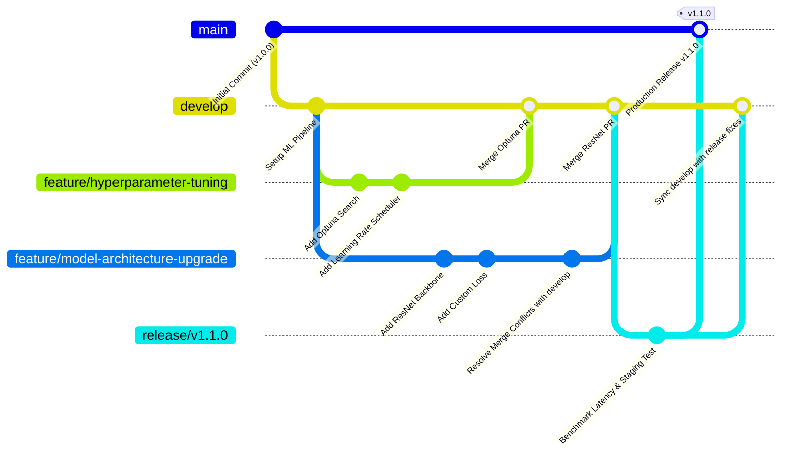

# Git Flow Branching Strategy for Machine Learning Projects

## 1. Executive Summary & Philosophy

In modern Machine Learning (ML) engineering, standard software development workflows are insufficient on their own. ML projects involve tight coupling between **code**, **data schemas**, **model weights**, **hyperparameter configurations**, and **experiment tracking metadata**.

This Git Flow Branching Strategy defines a robust, scalable version control model tailored specifically for ML teams. It ensures:
- **Reproducibility**: Every model deployment can be traced directly to an exact Git commit, data version (DVC tag), and environment specification.
- **Stability**: Production systems (`main`) remain rock-solid and deployable at all times.
- **Collaborative Agility**: Multiple ML researchers and data engineers can develop features concurrently without blocking the pipeline or contaminating shared branches.
- **Automated Governance**: Strict CI/CD quality gates for unit testing, data drift testing, and model performance baselines before merging.

---

## 2. Branch Hierarchy & Architecture

```
[main] (Production Models & Inference Endpoints)
   ▲
   │ (Release tag v1.2.0)
[release/v1.2.0] (Validation, Benchmarking, Model Registry Promotion)
   ▲
   │ (Staging freeze)
[develop] (Integration Branch for ML Pipelines)
   ▲                                   ▲
   │ (Squash & Merge)                  │ (Squash & Merge)
[feature/hyperparameter-tuning]     [feature/model-architecture-upgrade]
```

### 2.1 Branch Taxonomy

| Branch Name | Origin Branch | Merges Into | Purpose | Protection Rules |
| :--- | :--- | :--- | :--- | :--- |
| `main` | `release/*`, `hotfix/*` | *None* | Production-ready, validated models and serving code. | Force push disabled, requires 2 senior reviews + all CI checks passed. |
| `develop` | `main` | `release/*`, `main` | Integration branch containing the latest stable ML pipeline features. | Force push disabled, requires 1 review + automated integration tests. |
| `feature/*` | `develop` | `develop` | Specific ML feature or component (e.g. data preprocessing, model architecture, loss function). | Short-lived branch, squash & merge into `develop`. |
| `experiment/*` | `develop` | `develop` (Optional) | Exploratory ML hypotheses, rapid spikes, and proof-of-concepts. | Exploratory branch. Discarded if hypothesis fails; promoted to `feature/*` if successful. |
| `release/*` | `develop` | `main` and `develop` | Preparation for model release: load testing, latency benchmarking, compliance audits. | Bug fixes only during release freeze; no new features. |
| `hotfix/*` | `main` | `main` and `develop` | Urgent patches for critical production failures (e.g. inference crashes, data schema shifts). | Expedited review process, immediately back-merged into `develop`. |

---

## 3. Detailed Branch Lifecycle & Workflows

### 3.1 Feature Workflow (`feature/*`)

1. **Branching**:
   Always branch from the latest state of `develop`:
   ```bash
   git checkout develop
   git pull origin develop
   git checkout -b feature/ML-101-optuna-hyperparameter-tuning
   ```

2. **Development**:
   - Write clean, modular ML code with accompanying unit tests.
   - Decouple data and models from code using DVC or S3/GCS remote storage.
   - Commit frequently using Conventional Commits.

3. **Rebasing before PR**:
   Keep history linear and resolve upstream divergence early:
   ```bash
   git fetch origin
   git rebase origin/develop
   ```

4. **Pull Request & Merge**:
   - Open a PR from `feature/ML-101-optuna-hyperparameter-tuning` to `develop`.
   - CI triggers:
     - Code formatting (`flake8`, `black`).
     - Unit tests (`pytest tests/`).
     - Synthetic data pipeline smoke test.
   - Merge strategy: **Squash and Merge** (collapses messy experimental commits into one clean entry).

---

### 3.2 Experiment Workflow (`experiment/*`)

ML engineering requires hypothesis-driven exploration where code may not always reach production.

1. Branch from `develop`:
   ```bash
   git checkout -b experiment/EXP-42-vision-transformer-backbone
   ```
2. Track runs using an Experiment Tracker (MLflow / Weights & Biases):
   - Reference the Git commit hash in the MLflow run metadata.
3. If the experiment succeeds:
   - Clean up code, write unit tests, and create a formal `feature/` branch or PR into `develop`.
4. If the experiment fails:
   - Archive experiment run metrics in MLflow and delete the branch to avoid repository bloat.

---

### 3.3 Release Workflow (`release/*`)

When sufficient features accumulate in `develop` for a scheduled model update:

1. Create a release candidate branch:
   ```bash
   git checkout develop
   git pull origin develop
   git checkout -b release/v1.2.0
   ```
2. Run Release Validation Gates:
   - Model latency and throughput stress testing.
   - Out-of-sample test set metric verification against production baseline.
   - Model Card and documentation updates.
   - Model registry registration (e.g. MLflow Model Registry tag `Candidate`).
3. Merge into `main` and tag:
   ```bash
   git checkout main
   git merge --no-ff release/v1.2.0
   git tag -a v1.2.0 -m "Release v1.2.0: Optimized Transformer model with Optuna tuning"
   git push origin main --tags
   ```
4. Back-merge into `develop`:
   ```bash
   git checkout develop
   git merge --no-ff release/v1.2.0
   git push origin develop
   git branch -d release/v1.2.0
   ```

---

### 3.4 Hotfix Workflow (`hotfix/*`)

Used when production inference encounters critical defects (e.g. division by zero on zero-variance feature, unhandled missing categorical value):

1. Branch directly from `main`:
   ```bash
   git checkout main
   git pull origin main
   git checkout -b hotfix/v1.2.1-fix-nan-imputation
   ```
2. Implement fix and verify with regression tests.
3. Merge back into `main` and tag `v1.2.1`:
   ```bash
   git checkout main
   git merge --no-ff hotfix/v1.2.1-fix-nan-imputation
   git tag -a v1.2.1 -m "Hotfix v1.2.1: Robust imputation for edge-case NaN inputs"
   git push origin main --tags
   ```
4. Merge back into `develop` to ensure the fix is propagated:
   ```bash
   git checkout develop
   git merge --no-ff hotfix/v1.2.1-fix-nan-imputation
   git push origin develop
   git branch -d hotfix/v1.2.1-fix-nan-imputation
   ```

---

## 4. Branch Naming & Commit Conventions

### 4.1 Branch Naming Syntax
```
<type>/<ticket-id>-<short-description-in-kebab-case>
```

Examples:
- `feature/ML-201-add-focal-loss`
- `feature/ML-202-dataset-streaming-loader`
- `experiment/ML-203-lora-fine-tuning`
- `release/v2.1.0`
- `hotfix/v2.1.1-oom-batch-guard`

### 4.2 Conventional Commits
All commits must follow the Conventional Commits specification:
```
<type>(<scope>): <subject>

[optional body]

[optional footer(s)]
```

| Type | ML Scope Examples | Purpose |
| :--- | :--- | :--- |
| `feat` | `model`, `pipeline`, `preprocess` | New feature or model implementation |
| `fix` | `inference`, `metrics`, `loader` | Bug fix in code or pipeline logic |
| `refactor` | `trainer`, `loss`, `layers` | Code restructuring without behavior change |
| `test` | `eval`, `unit`, `drift` | Adding or updating tests |
| `docs` | `model-card`, `readme`, `strategy` | Documentation updates |
| `chore` | `dvc`, `requirements`, `docker` | Dependency or build tool changes |

Example:
```
feat(trainer): integrate optuna hyperparameter optimization engine

- Adds Optuna study wrapper with Tree-structured Parzen Estimator (TPE)
- Supports dynamic trial pruning via MedianPruner
- Closes ML-101
```

---

## 5. Machine Learning Specific Git Rules

### 5.1 No Large Binary Files in Git
- **Prohibited**: Never commit raw datasets (`.csv`, `.parquet`, `.h5`), model checkpoints (`.pt`, `.onnx`, `.bin`), or heavy logs.
- **Enforcement**:
  - Maintain a strict `.gitignore`.
  - Use **DVC (Data Version Control)** to track pointers (`data.dvc`, `models.dvc`).
  - Pre-commit hooks (`pre-commit`) installed locally to block files exceeding 10 MB.

### 5.2 Jupyter Notebook Governance
- Unstripped Jupyter Notebooks (`.ipynb`) with cell outputs create huge, unresolvable merge conflicts.
- **Rule**:
  - Run `nbstripout` via git filter or pre-commit hook before pushing.
  - Or maintain core logic in pure Python modules (`.py`) and use notebooks solely for reporting and visualization.

### 5.3 Automated CI/CD Gates for Pull Requests
Before any feature branch can merge into `develop`, the automated pipeline executes:
1. **Lint & Style**: `flake8`, `black --check`, `isort --check`.
2. **Deterministic Seed Unit Tests**: Verify model forward pass and loss backward pass with fixed random seeds.
3. **Data Contract Validation**: Ensure data schemas conform to expected shapes and dtypes (`pydantic` or `pandera`).
4. **Smoke Train Test**: Train for 1 epoch on 10 synthetic samples to prevent runtime crashes.

---

## 6. Visual Git Flow Diagram



---

## 7. Governance and Review Protocol

1. **Pull Request Description Template**:
   - Every PR must state:
     - Problem Statement & Motivation.
     - Description of ML code changes.
     - Validation metrics (Validation loss, F1-score, inference latency).
     - Link to experiment run tracker (MLflow run URL).
2. **Conflict Resolution Policy**:
   - Merge conflicts must be resolved by the author of the incoming branch in close consultation with the upstream feature author.
   - Never resolve ML conflicts by blindly discarding upstream changes. Combine algorithms or add configurable parameters.
   - Full test suites must be rerun locally and pass before completing the merge commit.
