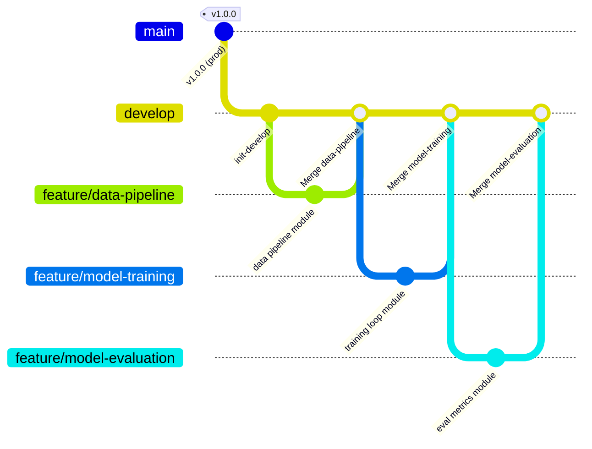

# ML Project Branching Strategy & Workflow Guide

## 1. Overview & Purpose

In production Machine Learning (ML) systems, code is deeply intertwined with data pipelines, model weights, experiment tracking, and infrastructure. A standard software engineering branching model is insufficient on its own; ML projects require strict reproducibility, experiment isolation, traceability of model artifacts, and automated verification of both code quality and pipeline integrity.

This document defines the official Git branching strategy, branch naming conventions, feature branch lifecycle, and merge requirements for reproducible and scalable ML pipelines.

---

## 2. Core Branch Hierarchy & Roles

Our strategy adopts an adapted GitFlow model optimized for Machine Learning pipelines with three primary tiers of branches:

```
                      [main] (Production releases & tagged models)
                        ▲
                        │ (Release PR / Hotfix PR)
                    [release/*]
                        ▲
                        │
                     [develop] (Integration & Staging)
                     ▲      ▲
         (Feature PR)│      │(Experiment PR)
                     │      │
            [feature/*]    [experiment/*]
```

### 2.1 `main` (Production & Releases)
* **Purpose**: Represents the single source of truth for production-ready code, deployment pipelines, model inference services, and validated training workflows.
* **Stability Level**: **Strictly Stable**. Code in `main` is always ready for automated production deployment.
* **Direct Commits**: **Forbidden**. No direct pushes or force pushes under any circumstances.
* **Tagging & Releases**: Every merge into `main` is tagged with a semantic version (e.g., `v1.2.0`), corresponding to an audited model version in the Model Registry.
* **Retention**: Permanent.

### 2.2 `develop` (Integration & Pre-Production)
* **Purpose**: Serves as the central integration branch for completed features, tested pipeline components, and validated model architectures. Acts as the staging environment.
* **Stability Level**: **Stably Integrated**. All code has passed automated unit tests, integration tests, and pipeline smoke tests.
* **Direct Commits**: **Forbidden**. Changes must be integrated via Pull Requests (PRs).
* **Retention**: Permanent.

### 2.3 Supporting Branches

| Branch Pattern | Base Branch | Merge Target | Purpose | Lifespan |
| :--- | :--- | :--- | :--- | :--- |
| `feature/*` | `develop` | `develop` | Development of pipeline steps, preprocessing, APIs, infra | Temporary (deleted after merge) |
| `experiment/*` | `develop` | `develop` | ML model exploration, architecture trials, hyperparameter tuning | Temporary |
| `bugfix/*` | `develop` | `develop` | Resolving bugs identified in staging or development | Temporary |
| `release/*` | `develop` | `main` & `develop` | Release stabilization, version bumping, changelog updates | Temporary |
| `hotfix/*` | `main` | `main` & `develop` | Critical emergency fixes directly impacting production | Temporary |

---

## 3. Branch Naming Conventions

All branch names must strictly follow structured prefixes and kebab-case naming to ensure traceability to tracking boards (Jira, GitHub Issues) and automated CI pipeline routing.

### 3.1 Syntax Pattern
```
<type>/<ticket-id>-<short-description>
```

* **`<type>`**: One of `feature`, `experiment`, `bugfix`, `hotfix`, `release`, `data`
* **`<ticket-id>`**: Issue tracker identifier (e.g., `ML-104`, `DS-42`, `GH-89`), or `exp-<id>` for experimental studies.
* **`<short-description>`**: 2–4 lowercase words separated by hyphens (`-`) summarizing the change.

### 3.2 Branch Categories & Concrete Examples

| Branch Type | Syntax | Valid Examples | Description / Scope |
| :--- | :--- | :--- | :--- |
| **Feature** | `feature/<ticket>-<description>` | `feature/ML-104-dvc-pipeline-caching`<br>`feature/ML-120-add-xgboost-trainer`<br>`feature/ML-135-batch-inference-api`<br>`feature/data-pipeline`<br>`feature/model-training` | New capabilities, pipeline components, data transformations, evaluation metrics. |
| **Experiment** | `experiment/<id>-<description>` | `experiment/EXP-12-vit-vs-resnet`<br>`experiment/EXP-34-focal-loss-tuning`<br>`experiment/ML-99-optuna-hpo` | Research, novel architectures, hyperparameter searches, feature selection studies. |
| **Bugfix** | `bugfix/<ticket>-<description>` | `bugfix/ML-112-fix-nan-gradient-clipping`<br>`bugfix/ML-140-null-feature-imputation` | Non-critical fixes for staging/develop pipelines and data ingestion. |
| **Hotfix** | `hotfix/<ticket>-<version-patch>` | `hotfix/PROD-01-fix-inference-timeout`<br>`hotfix/v1.2.1-cuda-oom-batch-size` | High-priority production issues branching directly off `main`. |
| **Release** | `release/<version>` | `release/v1.2.0`<br>`release/v2.0.0-rc1` | Release candidate stabilization branch. |

### 3.3 Invalid Branch Names
* ❌ `new-feature` *(missing prefix, no ticket reference)*
* ❌ `feature/add_data_loader` *(use hyphens, not underscores)*
* ❌ `Feature/ML-10-DataClean` *(use lowercase only)*
* ❌ `experiment-test` *(missing slash separator and ID)*
* ❌ `john/my-work` *(do not name branches after individuals)*

---

## 4. Example Feature Branch Structure & Lifecycle

### 4.1 Git Flow Workflow Diagram



### 4.2 Step-by-Step Lifecycle of a Feature Branch

1. **Pull Latest Integration Code**:
   ```bash
   git checkout develop
   git pull origin develop
   ```

2. **Create Branch with Proper Convention**:
   ```bash
   git checkout -b feature/data-pipeline
   ```

3. **Atomic Commits & Versioning**:
   ```bash
   git add practice/week-04-practice-merging-with-branching-strategy/src/data_pipeline.py
   git commit -m "feat(pipeline): implement data ingestion, validation, and preprocessing pipeline"
   ```

4. **Rebase Onto Develop Before Submitting**:
   Keep branch history linear and resolve any merge conflicts locally before PR submission:
   ```bash
   git fetch origin
   git rebase origin/develop
   ```

5. **Push and Open Pull Request / Merge with `--no-ff`**:
   ```bash
   git push origin feature/data-pipeline
   git checkout develop
   git merge --no-ff feature/data-pipeline -m "Merge branch 'feature/data-pipeline' into develop - data ingestion & preprocessing"
   ```

---

## 5. Merge Requirements & Quality Gates

To preserve the reproducibility of the ML pipeline and maintain high code and model standards, all PRs must fulfill rigorous quality gates before merging.

### 5.1 Mandatory Automated CI/CD Checks

Before any PR can be merged into `develop` or `main`, the CI pipeline must pass 100%:

1. **Code Formatting & Linting**:
   * Code formatting: `black --check .`, `isort --check-all .`
   * Linting: `flake8` or `ruff` with zero errors.
   * Type Checking: `mypy src/` passes.

2. **Automated Testing**:
   * Unit tests: `pytest tests/unit/` (minimum 80% coverage required).
   * Integration tests: Pipeline stage integration tests `pytest tests/integration/`.

3. **ML Pipeline Smoke Test**:
   * Execution of a lightweight pipeline run (`dvc repro` or script dry-run) using a deterministic sample dataset (e.g., 100 rows / 1 epoch) to verify that end-to-end data transformation, model forward pass, and metric calculation run without errors.

4. **Configuration Validation**:
   * Validation of schema configuration files (Hydra / Pydantic models) to ensure hyperparameter syntax consistency.

### 5.2 Code Review Policy

* **Minimum Approvals**:
  * Merges into `develop`: Minimum **1 approval** from an ML Engineer or Data Scientist peer.
  * Merges into `main`: Minimum **2 approvals**, including the Lead ML Engineer / Repository Maintainer.

---

## 6. Real-World Merge Workflow Examples & Procedures

This section details standard operational merge procedures utilized across feature integration into `develop`, ensuring strict adherence to Git Flow, traceability, and a pristine commit graph.

### 6.1 Feature Branch to Develop Merge Procedure

All feature work branches off `develop` and integrates back into `develop` once tests and code reviews succeed.

#### Detailed Step-by-Step Execution:

1. **Keep Local Base Up to Date**:
   ```bash
   git checkout develop
   git pull origin develop
   ```

2. **Create Standard Feature Branch**:
   ```bash
   git checkout -b feature/data-pipeline
   ```

3. **Develop and Commit Incrementally**:
   Make clear, atomic commits following conventional commit syntax:
   ```bash
   git add practice/week-04-practice-merging-with-branching-strategy/src/data_pipeline.py
   git commit -m "feat(pipeline): implement data ingestion, validation, and preprocessing pipeline"
   ```

4. **Rebase Onto Latest Develop Before Merging**:
   To prevent uncoordinated divergence and eliminate merge conflicts proactively:
   ```bash
   git fetch origin
   git rebase origin/develop
   ```
   *If conflicts occur, resolve conflict markers, run `git add <resolved_file>`, and continue with `git rebase --continue`.*

5. **Merge Back to Develop**:
   Using `--no-ff` (non-fast-forward) to explicitly record branch integration milestones in history:
   ```bash
   git checkout develop
   git merge --no-ff feature/data-pipeline -m "Merge branch 'feature/data-pipeline' into develop - data ingestion & preprocessing"
   ```

6. **Push to Remote Repository**:
   ```bash
   git push origin develop
   git push origin feature/data-pipeline
   ```

---

### 6.2 Sequential Multi-Feature Integration Example

When multiple engineers deliver concurrent pipeline modules (e.g., `feature/data-pipeline`, `feature/model-training`, `feature/model-evaluation`), follow this sequential integration pattern:

```mermaid
gitGraph
    commit id: "develop-base"
    branch feature/data-pipeline
    checkout feature/data-pipeline
    commit id: "feat: data pipeline"
    checkout develop
    merge feature/data-pipeline id: "Merge data-pipeline"
    
    branch feature/model-training
    checkout feature/model-training
    commit id: "feat: model trainer"
    checkout develop
    merge feature/model-training id: "Merge model-training"

    branch feature/model-evaluation
    checkout feature/model-evaluation
    commit id: "feat: evaluation metrics"
    checkout develop
    merge feature/model-evaluation id: "Merge model-evaluation"
```

#### Step-by-Step Commands:

1. **Merge Feature 1: Data Pipeline (`feature/data-pipeline`)**:
   ```bash
   git checkout develop
   git merge --no-ff feature/data-pipeline -m "Merge branch 'feature/data-pipeline' into develop - data ingestion & preprocessing"
   ```

2. **Sync and Merge Feature 2: Model Training (`feature/model-training`)**:
   Before merging `feature/model-training`, synchronize it with the newly updated `develop`:
   ```bash
   git checkout feature/model-training
   git rebase develop
   git checkout develop
   git merge --no-ff feature/model-training -m "Merge branch 'feature/model-training' into develop - training loop & checkpointing"
   ```

3. **Sync and Merge Feature 3: Model Evaluation (`feature/model-evaluation`)**:
   ```bash
   git checkout feature/model-evaluation
   git rebase develop
   git checkout develop
   git merge --no-ff feature/model-evaluation -m "Merge branch 'feature/model-evaluation' into develop - evaluation metrics & quality gate"
   ```

---

### 6.3 Commit History Cleanliness Best Practices

Maintaining an intelligible Git history is vital for machine learning reproducibility, auditability, and pipeline verification.

| Practice | Guideline | Command Example |
| :--- | :--- | :--- |
| **Atomic Commits** | Each commit addresses one logical component or fix. | `git commit -m "feat(data): add schema validation rules"` |
| **Explicit Merge Commits** | Preserves feature branch boundaries and context (`--no-ff`). | `git merge --no-ff <branch-name> -m "Merge branch ..."` |
| **Interactive Rebasing** | Clean up intermediate WIP commits prior to merging. | `git rebase -i HEAD~3` |
| **Conflict Resolution** | Resolve conflicts on the feature branch, never directly on `develop`. | `git checkout <feature> && git rebase develop` |
| **History Verification** | Review branch topologies visually before pushing upstream. | `git log --graph --oneline --decorate -n 15` |

---

### 6.4 Verification and Git Graph Inspection

After completing feature merges into `develop`, inspect the commit hierarchy with:
```bash
git log --graph --oneline --decorate --all -n 20
```

Expected topology sample:
```
*   0a1b2c3 (HEAD -> develop) Merge branch 'feature/model-evaluation' into develop - evaluation metrics & quality gate
|\  
| * e4f5678 (feature/model-evaluation) feat(evaluation): implement performance metrics computation and quality gates
|/  
*   9d8e7f6 Merge branch 'feature/model-training' into develop - training loop & checkpointing
|\  
| * a1b2c3d (feature/model-training) feat(training): implement model trainer, loss logging, and checkpointing
|/  
*   5e6f7a8 Merge branch 'feature/data-pipeline' into develop - data ingestion & preprocessing
|\  
| * 3b4c5d6 (feature/data-pipeline) feat(pipeline): implement data ingestion, validation, and preprocessing pipeline
|/  
* 1a2b3c4 Base commit on develop
```

---

## 7. Summary Quick-Reference Table

| Operation | Command / Pattern |
| :--- | :--- |
| Start new feature | `git checkout develop && git pull && git checkout -b feature/<name>` |
| Start ML experiment | `git checkout develop && git pull && git checkout -b experiment/EXP-<id>-<name>` |
| Commit with Conventional Commit | `git commit -m "feat(pipeline): implement data ingestion [ML-101]"` |
| Sync with develop before PR | `git fetch origin && git rebase origin/develop` |
| Merge feature into develop | `git merge --no-ff feature/<name> -m "Merge branch 'feature/<name>' into develop - <description>"` |
| Merge method to `develop` | **Squash and Merge** or **Merge Commit (`--no-ff`)** via PR |
| Merge method to `main` | **Merge Commit** via Release PR |
